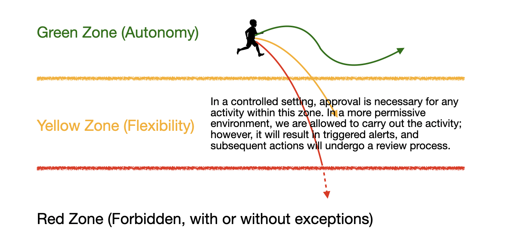

# Balances Autonomy and Security

In our recent cloud journey, we developed a policy to mark and notify owners about un-preserved, aged EBS snapshots. If no action is taken within a specified timeframe, it triggers a deletion operation. This structured approach ensures that resources are not only cleaned up but also gives resource owners the opportunity to preserve snapshots deemed necessary. Within the timeframe, resource owners have the autonomy to decide the retention period for their snapshots.

Let's broaden the scope of this topic. Cloud governance is the process of managing and controlling the use of cloud resources. It involves establishing policies, rules, and standards for how tenants can access and utilize the cloud platform.

One of the main challenges of cloud governance is to balance the autonomy and security of tenants. Autonomy means giving tenants the freedom and flexibility to use the cloud platform as they wish. Security means ensuring that the cloud platform is protected from threats and risks.

How can we design a cloud governance platform that achieves this balance? We will introduce a design philosophy that uses two concepts: the free zone and the prohibition zone.

## The Free Zone

The free zone is the space where tenants can operate with a high level of autonomy. In the free zone, tenants can experiment and innovate without fear of breaking the platform. They can create, modify, and delete cloud resources as they need. They can also choose the best tools and technologies for their needs.

The free zone is beneficial for tenants because it allows them to:

- Achieve their goals faster and more efficiently
- Explore new possibilities and opportunities
- Learn and grow from their experiences

The free zone is also beneficial for the cloud platform because it enables:

- Higher tenant satisfaction and retention
- Greater diversity and creativity
- Faster feedback and improvement

## The Prohibition Zone

The prohibition zone is the space where tenants are not allowed to operate. In the prohibition zone, tenants are restricted from accessing or using certain cloud resources. These resources are either critical for the platform's security and reliability, or harmful for the platform's performance and efficiency.

The prohibition zone is necessary for the cloud platform because it ensures that:

- The platform is secure and reliable
- The platform is compliant and accountable
- The platform is scalable and cost-effective

The prohibition zone is also necessary for tenants because it protects them from:

- Accidental or intentional damage to the platform
- Legal or ethical violations or liabilities
- Unnecessary or wasteful expenses or resources

## How to Define the Free Zone and the Prohibition Zone

The free zone and the prohibition zone are not fixed or static. They can vary depending on the context and the needs of the tenants and the platform. Therefore, it is important to define them clearly and communicate them effectively.

To define the free zone and the prohibition zone, we need to consider:

- The goals and objectives of the tenants and the platform
- The risks and benefits of allowing or restricting certain cloud resources
- The trade-offs and compromises between autonomy and security

To communicate the free zone and the prohibition zone, we need to use:

- Policies and rules that specify what tenants can and cannot do in the cloud platform
- Guardians and safety nets that monitor and enforce the policies and rules
- Feedback and education that inform and guide the tenants on how to use the cloud platform

## Conclusion

Designing a cloud governance platform is a balancing act. On one hand, we want to offer tenants as much autonomy as possible. On the other hand, we need to provide guardians and a safety net to ensure that the platform remains secure and reliable. The key to achieving this balance is to create a free zone where tenants can operate with a high level of autonomy, and a prohibition zone where tenants are not allowed to operate.
