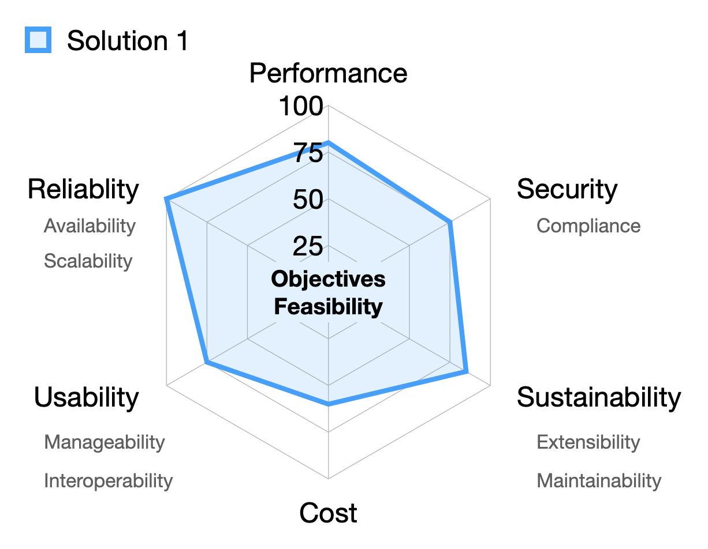

# Reviewing Software Solutions and Architectures

When evaluating a software solution or architecture, it's essential to conduct a thorough review to ensure it aligns with the intended objectives and quality standards. In this article, we'll explore the key steps for reviewing a solution and delve into assessing its various "ilities."

## 1. **Meeting Objectives and Feasibility**

### 1.1 Objectives Assessment

Before diving into technical details, start by examining whether the solution meets its primary objectives. Consider the following:

- **Problem Solving**: Does the solution effectively address the problem it was designed for? Is it aligned with business goals?
- **Expected Outcomes**: Evaluate whether the solution delivers the expected results.
- **Value Addition**: Assess how the solution benefits users or the organization.

### 1.2 Feasibility Evaluation

Feasibility analysis ensures that the solution is practical and viable. Consider the following factors at a high-level:

- **Cost**: Evaluate the financial implications, including development costs, maintenance, and licensing fees.
- **Time**: Assess the project timeline and time-to-market.
- **Resources**: Consider the availability of skilled personnel, hardware, and software resources.
- **Technology Compatibility**: Ensure that the chosen technology stack aligns with existing systems.
- **Regulatory Compliance**: Verify that the solution adheres to legal and industry standards.

## 2. **Reviewing the "Ilities"**

Now let's dive into the specific "ilities" that characterize a robust software solution:

### 2.1 **Performance**

- **Definition**: Performance refers to how well the system operates under various conditions.
- **Parameters to Evaluate**:
  - Speed: Is the solution responsive and efficient?
  - Throughput: Can it handle expected loads?
  - Resource Utilization: Is it optimized in terms of memory and CPU usage?

### 2.2 **Reliability**

- **Definition**: Reliability ensures that the system operates without failure under specified conditions.
- **Parameters to Evaluate**:
  - Availability: Is the system accessible when needed?
  - Fault Tolerance: How well does it handle errors and exceptions?
  - Mean Time Between Failures (MTBF): Assess the average time between failures.

### 2.3 **Availability**

- **Definition**: Availability refers to the system's uptime and accessibility.
- **Parameters to Evaluate**:
  - Downtime: Minimize unplanned outages.
  - Redundancy: Implement failover mechanisms.

### 2.4 **Scalability**

- **Definition**: Scalability assesses the system's ability to handle increased loads.
- **Parameters to Evaluate**:
  - Vertical Scalability: Can it handle growth within a single server?
  - Horizontal Scalability: Is it designed for distributed environments?

### 2.5 **Usability**

- **Definition**: Usability focuses on end-users' experience.
- **Parameters to Evaluate**:
  - Intuitiveness: Is the system easy to learn and use?
  - User Interface (UI): Assess the design and navigation.

### 2.6 **Manageability**

- **Definition**: Manageability relates to system administration.
- **Parameters to Evaluate**:
  - Monitoring: Can administrators track performance and issues?
  - Maintenance: How easy is it to apply updates and patches?

### 2.7 **Interoperability**

- **Definition**: Interoperability assesses compatibility with other systems.
- **Parameters to Evaluate**:
  - APIs: Can it integrate seamlessly with external services?
  - Data Formats: Does it support common data exchange formats?

### 2.8 **Security & Compliance**

- **Definition**: Security ensures protection against unauthorized access and data breaches.
- **Parameters to Evaluate**:
  - Authentication: Verify user identities.
  - Encryption: Protect sensitive data.
  - Compliance: Adhere to legal and industry standards.

### 2.9 **Sustainability & Extensibility**

- **Definition**:
  - Sustainability: Consider long-term viability.
  - Extensibility: Assess how easily the system can accommodate future changes.

## Conclusion

By following this systematic approach, we can conduct a comprehensive review of any software solution or architecture. Remember that each "ility" contributes to the overall success of the system, ensuring it meets both functional and non-functional requirements.
