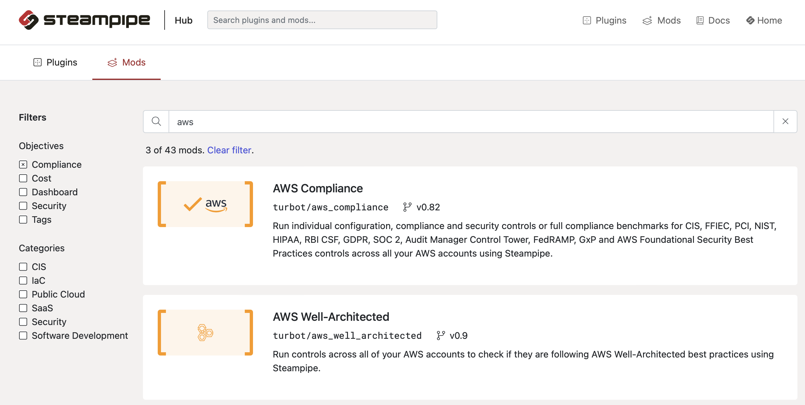

# A Dive into Steampipe Integration

In the landscape of software development, the dynamics are starkly different from traditional manufacturing processes. Unlike tangible products, the cost of duplicating a software solution is nearly negligible. In this scenario, a wise software development team refrains from reinventing the wheel. Anything they create should either be unique or significantly distinguishable from existing market products. If not, the prudent approach is to explore procurement options, as someone in the market likely sells a comparable solution at a cost lower than a home-grown alternative.

This philosophy extends to governance platforms. The choice to adopt Cloud Custodian, for instance, aligns with the principle of not reinventing what already exists. However, upon closer examination, governance requirements can typically be categorized into two groups: common and personalized. For common needs, mature products in the market should be engaged. This approach acknowledges the complexity of today's governance landscape, realizing that a few teams cannot efficiently address the multifaceted requirements within an acceptable timeframe.

When commercial solutions are unavailable, Steampipe emerges as a compelling option (check it out at [steampipe.io](https://steampipe.io)). Steampipe is a versatile tool equipped with various modules catering to different cloud platforms and services. These modules, or mods, offer pre-built queries and checks to assess and ensure compliance with various standards and best practices.



For instance, consider the integration steps for leveraging Steampipe's AWS CIS module to ensure EBS volume encryption is enabled in all regions:

1. Execute the control `cis_v200_2_2_1` and save the result into a file.

    ```shell
    steampipe check aws_compliance.control.cis_v200_2_2_1 --output=brief --export=../../$output_dir/cis_v200_2_2_1.json
    ```

2. Load the file generated above and filter EBS volumes based on their IDs.

    ```yaml
    policies:
      - name: cis_v200_2_2_1
        resource: aws.ebs
        filters:
          - type: value
            key: VolumeId
            op: in
            value_from:
              url: file:{output_dir}/cis_v200_2_2_1.json
              expr: controls[].results[?status=='alarm'][].resource
        actions:
          # ...
    ```

Integrating with Steampipe immediately opens up opportunities. Now, the findings from Steampipe mods can be acted upon, allowing for actions like notification and remediation. This seamless integration provides a streamlined approach to governance, allowing teams to efficiently address compliance issues and take necessary actions without reinventing solutions for common problems like CIS compliance.

In summary, making smart software choices, whether through procurement or leveraging tools like Steampipe, allows organizations to optimize their resources and focus on building what truly differentiates them in the market.
