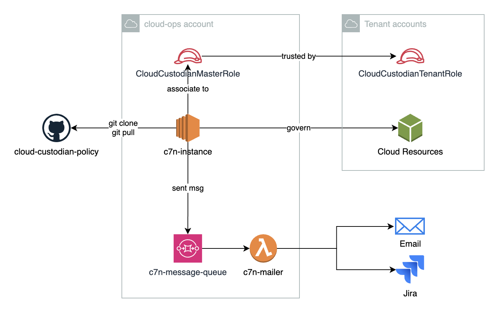

# A Practical Deployment Architecture

In our previous discussions, we've put together an account list, defined policies, and a mailer for deployment. Now, the spotlight is on the deployment architecture.

### The Simplest Architecture: Centralized Cloud Ops

Our chosen architecture centers around a `cloud-ops` account responsible for managing all tenant cloud resources. Regular updates are ensured through scheduled `git clone` and `git pull` operations. Transmiting messages between accounts is facilitated by a robust message queue. This straightforward infrastructure can be effortlessly deployed using Terraform scripts and bootstrapped with user data.



We could delve into more advanced architectures, such as placing EC2 instances into an Auto Scaling Group (ASG) to guarantee a continuous instance presence. Container technologies like Docker and Kubernetes could also be leveraged. For the boldest move, consider deploying all policies as lambda functions, eliminating the need for EC2 maintenance. But beware, each advancement comes with its own set of trade-offs.

To make informed decisions, adopt a systems thinking approach and conduct a comprehensive 360-degree review. Utilizing an analysis model, such as the AWS Well-Architected 6 Pillars, can guide us in choosing the most suitable option.

### Scheduling Policy Execution: Finding the Sweet Spot

With the architecture finalized, the next step is scheduling the regular execution of policies. Whether it's once a week at 9 am or during off-hours, it's crucial to align with organizational preferences. Personally, I recommend office hours, given well-tested policies and a gradual rollout procedure.

Implementing this schedule can be as simple as setting up a cron job. Take a look at the example below:

```bash
0 9 * * 2 cd /opt/cloud-custodian-policy && poetry run c7n-org -s logs/aws -c aws/accounts/my-org-a.yml -u aws/policies/ebs-snapshot-cleanup-better-notification.yml
```

However, manually configuring cron jobs for each policy may become challenging and cumbersome. To streamline this process, consider creating a script that converts a YAML format configurations into cron job configurations, as demonstrated below:

```yaml
# aws/deployments/my-org-a-nonprod.yml
deployments:
  - accounts: aws/accounts/my-org-a.yml
    policies:
      - aws/policies/ebs-snapshot-cleanup-better-notification.yml
    schedule:
      cron: 0 9 * * 2
```

This YAML-based configuration provides a cleaner and more maintainable approach to scheduling policy executions, simplifying our cloud operations journey. We could build more useful feature around the script in the future.

In conclusion, a well-thought-out deployment architecture coupled with a strategic scheduling approach sets the stage for efficient cloud operations. Balancing simplicity with advanced features and aligning with organizational preferences ensures a robust foundation for managing cloud resources effectively.
