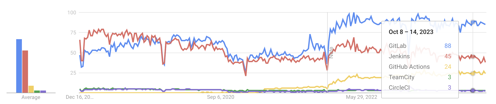

# CICD Pipeline

A CI/CD pipeline is a process that automates the steps of building, testing, and deploying software. It enables faster and more reliable delivery of software products. This project is not complex. It did not require integration testing, acceptance testing, or advanced deployment strategies like blue/green. The main tasks of the CI/CD pipeline were:

- Build: Install python dependencies
- Validate: Check the code quality and style using tools like linting and code analysis
- Unit test: Run automated tests to verify the functionality of individual units of code
- Deploy: Create the runtime infranstructure

I learned some valuable lessons from using a CI/CD pipeline. Here are some of the best practices that I followed or discovered:

- **Don't put too much logic in the CI/CD pipeline**: Although modern CI/CD tools are powerful and flexible, they are not designed to handle complex logic or tasks. Instead, they are meant to orchestrate the execution of other tools or scripts that can perform those tasks. For example, instead of writing a long and complicated script in the CI/CD tool to perform some custom operation, it is better to write a separate shell script or use another tool that can do the same thing, and then call it from the CI/CD pipeline. This way, the script or tool can be tested and verified locally, and the CI/CD pipeline can remain simple and easy to maintain.
- **Choose a popular and reliable CI/CD tool**: There are many CI/CD tools available in the market, each with its own features and advantages. However, not all of them are equally popular or reliable. Choosing a popular and reliable CI/CD tool can save a lot of time and trouble in the long run. Popular tools usually have more documentation, support, and community resources, which can help in solving problems or learning new skills. Reliable tools usually have more stability, security, and performance, which can ensure the quality and efficiency of the CI/CD pipeline. Some of the most popular and reliable CI/CD tools are Jenkins, GitHub Actions, and GitLab. Below is a Google Trends chart that shows the relative popularity of these tools in the past 5 years:

  

- **Be careful with secrets, credentials, and sensitive information**: A CI/CD pipeline often needs to access or use secrets, credentials, and sensitive information, such as passwords, tokens, keys, certificates, etc. These are essential for authenticating or authorizing the CI/CD pipeline to perform certain actions, such as accessing a repository, a server, or a cloud service. However, these are also very vulnerable to theft, leakage, or misuse, which can compromise the security and integrity of the CI/CD pipeline and the software product. Therefore, it is important to store and use them safely, following the best practices and the security policy of the organization. Some of the best practices are:

  - Use a secure and encrypted storage system, such as a vault or a secret manager, to store the secrets, credentials, and sensitive information, and retrieve them only when needed
  - Use encryption, hashing, or masking to protect the secrets, credentials, and sensitive information from being exposed in the logs, reports, or outputs of the CI/CD pipeline
  - Use the principle of least privilege, which means granting the minimum level of access or permission that is required for the CI/CD pipeline to perform its tasks, and revoking or rotating them regularly
